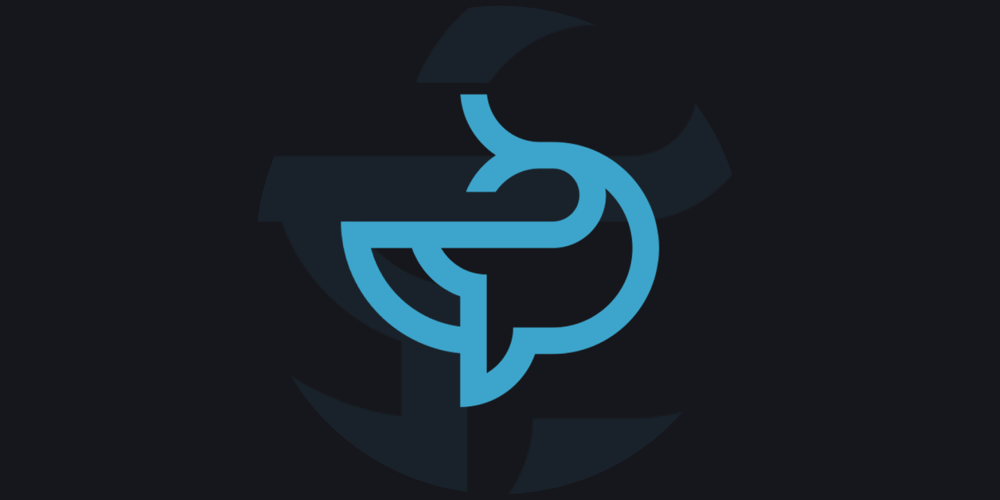

<p align="center">
  <br/>
  <a href="https://github.com/mcpronovost/oykus">Oykus</a> &mdash; where every player is both author and adventurer
  <br/><br/>
</p>

<div align="center">

[](./CHANGELOG.md)
[](./LICENSE)
[](#)
[](#)

</div>

Oykus is an **experimental RPG project** blending story-creation with gameplay — letting players shape narratives while they play.

- **Backend:** PHP
- **Frontend:** Vite/React

> _This project is a work in progress — but the foundation is set and contributions are welcome!_

---

## 🌟 Features

- ✅ **Core**: Core functionality and shared utilities
- ✅ **Auth**: User authentication, data, online users and guests, friends management

- 🧱 **Courrier**: Private messaging and alerts functionality
- 🔨 **Blog**: Share content, information and updates
  - ✅ Posts
  - ✅ Reactions
  - 🔨 Comments
- 🧱 **Collectibles**: Collect and manage objects
  - 🧱 Collections
  - 🧱 Items
- 🧱 **Forum**: Chat and interact with other members
  - 🧱 Categories
  - 🧱 Sections
  - 🧱 Topics
  - 🧱 Posts
  - 🧱 Reads
  - 🧱 Reactions
  - 🧱 Threads
- 🧱 **Game**: Game mechanics specific to each universe
- 🧱 **Leveling**: Gain levels based on interactions and activities
- ✅ **Planner**: Plan and track tasks, assign people, and more
  - ✅ Statuses
  - ✅ Tasks
  - 🔨 Assignees
- 🔨 **Rewards**: Unlock achievements, earn titles, badges, and more
  - 🔨 Achievements
  - 🧱 Titles
  - 🧱 Badges

## 🌐 Internationalization

The platform supports multiple languages:

- French (default)
- English

## 🚀 Quick Start (Dev)

Get the project up and running locally with minimal friction (be sure to have Docker Desktop installed):

1. **Clone the repo**

   ```bash
   git clone https://github.com/mcpronovost/oykus.git
   cd oykus
   ```

2. **Build the containers**

   ```bash
   docker compose build
   ```

3. **Start the containers**

   ```bash
   docker compose up
   ```

4. **Run migrations inside backend container**

   ```bash
   php api/oyk/core/scripts/migrate.php
   ```

5. **Run sql statements inside database container**
   ```bash
   mysql -u DB_USER -p DB_NAME
   ```
